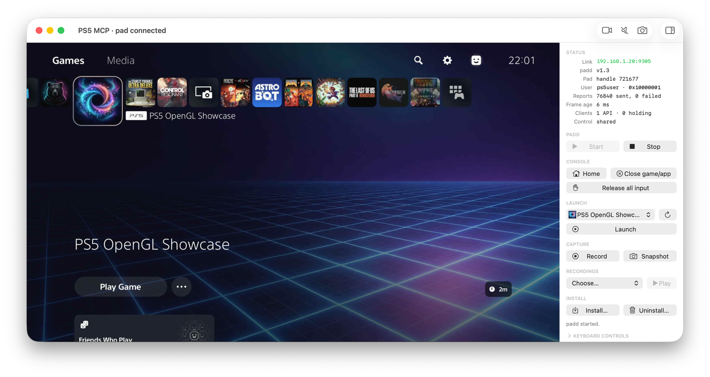

<p align="center">
  
</p>

# PS5 MCP

See and control a jailbroken PS5 from an MCP agent or your keyboard, with live HDMI video and audio.
**macOS only for now,** Windows and Linux support is planned.

<p align="center">
  
</p>

## Requirements

- A jailbroken PS5, currently firmware **13.60**. Payload Manager and PS5 Web File Manager are recommended
  (see [Console services](#console-services)).
- An HDMI capture card connected to the Mac, with **HDCP disabled** on the PS5
  (Settings → System → HDMI → Enable HDCP).
- **macOS 14 or later**, with network access to the console.
- To build: Xcode with a signing account, Homebrew, Python 3.12+, and the tools installed below.
  The payload uses PS5 Payload SDK v0.43 and LLVM 18.1.8.

### Console services

Controlling the console needs only `padd` running, however it was loaded. These payloads add padd Start/Stop, the
game/app list, Install, and file transfers:

| Service | Port | Used for |
|---|---|---|
| [Payload Manager](https://github.com/itsPLK/ps5-payload-manager) (v0.5.2 tested) | 8084 | Deploying `padd` (Start), checking its process is gone (Stop), and installing `.elf` payloads |
| [PS5 Web File Manager](https://github.com/owendswang/ps5-web-file-manager) (v1.9 tested; Payload Manager can load it) | 8888 | Verifying the `padd` upload and reading its logs (Start/Stop), the game/app list (app and `list_apps`), and installing `.pkg` packages |
| [zftpd](https://github.com/seregonwar/zftpd) (v1.6.0 FTP-only `zftpd-ps5-v1.6.0.elf`; optional) | 2120 | `push`/`pull` over FTP. Add it to Payload Manager's library as `zftpd.elf`; it is started when first needed |

Without them, load `padd.elf` with any ELF loader.
PS5 MCP expects Web File Manager on port 8888; it moves to the next free port when 8888 is taken.

To add zftpd, download `zftpd-ps5-v1.6.0.elf` from its
[releases](https://github.com/seregonwar/zftpd/releases), rename it to `zftpd.elf`, and add it to Payload Manager's
library with `uv run ps5mcp install zftpd.elf` (or Payload Manager's web page). Do not run it yourself: `push` and
`pull` start it when they first need it. Without zftpd, `push` is slower and `pull` copies single files only.

## How it works

- **`padd`** is a payload running on the PS5. It creates a virtual DualSense and accepts controller input over
  TCP port 9305.
- **The PS5 MCP app** captures HDMI video and audio, owns the connection to `padd`, and provides keyboard
  controls, payload Start/Stop, status, and install/uninstall. It talks to Payload Manager and Web File Manager
  only for the tasks listed above.
- **The MCP server** connects agents to the app's local API. Multiple agent sessions and the keyboard can
  share the console.

## Setup

```sh
brew install llvm@18 ffmpeg mpv uv xcodegen
make bootstrap      # pinned SDK and Python environment
make check          # lint, tests, payloads, and the macOS release app
```

The release app is built at `build/PS5 MCP.app`. It is signed ad hoc, so macOS asks for its permissions again after
each rebuild. To keep them, sign with your Apple team: `make app DEVELOPMENT_TEAM=… APP_BUNDLE_ID=…` or
`app/Configuration/LocalSigning.xcconfig` (copy the `.example`). Quit the app before rebuilding.
No `make` target contacts the console.

## Usage

1. **Point it at the console:** `export PS5_HOST=192.168.1.20` (your PS5's IP address). There is no default.
   The CLI commands also take `--host`. In the app, set the address in **Settings** (**⌘,**). The app saves it
   and reconnects to it at once. When the app starts, `--host` and `PS5_HOST` win over the saved address.
2. **Open the app:** `uv run ps5mcp view` or `open --env PS5_HOST=$PS5_HOST "build/PS5 MCP.app"`. Allow camera, microphone,
   local network, and Documents access when prompted.
3. **Start `padd`** with **Start** or `uv run ps5mcp padd start`, once per console boot. The app answers
   the user-selection dialog automatically. If your DualSense turns off, press its PS button and select your user again.
4. **Control the console** from the app window or connect an MCP client (see [MCP clients](#mcp-clients)).
5. **Stop `padd`** with **Stop** or `uv run ps5mcp padd stop` before turning off the console. Killing it
   through Payload Manager can leave a phantom controller until reboot.

The MCP server starts the app when needed, headless by default (`PS5MCP_VIEW=1` shows the window).
Closing an MCP session leaves the app running; quitting the app releases input and leaves `padd` running.

### MCP clients

Every client runs the same server from this checkout: `uv run --project <repo> ps5mcp-server`, with `PS5_HOST` set.
Use the full path to `uv` (`command -v uv`) if the client does not have Homebrew on its `PATH`.

**Claude Code:**

```sh
claude mcp add ps5 -e PS5_HOST=192.168.1.20 -- uv run --project /path/to/ps5-mcp ps5mcp-server
```

**Codex:** add this to `~/.codex/config.toml` (or run
`codex mcp add ps5 --env PS5_HOST=192.168.1.20 -- uv run --project /path/to/ps5-mcp ps5mcp-server` and add the
timeouts after). Installs and file transfers can take minutes, longer than Codex's default tool timeout.

```toml
[mcp_servers.ps5]
command = "/opt/homebrew/bin/uv"
args = ["run", "--project", "/path/to/ps5-mcp", "ps5mcp-server"]
startup_timeout_sec = 60   # the first start can launch the app
tool_timeout_sec = 600     # install, push, and pull

[mcp_servers.ps5.env]
PS5_HOST = "192.168.1.20"
```

**Other clients** that read a JSON config: see [examples/mcp.json](examples/mcp.json).

Check the setup with `claude mcp list` or `codex mcp list`, then `/mcp` in a session. Agents from all clients share
the console through the same claim and queue (see [Sharing the console](#sharing-the-console)). A running session
keeps the server code it started with; restart it after updating this checkout.

### Live window and keyboard

The window shows live video, audio, and connection status. The sidebar has these controls:

- **padd:** Start and Stop.
- **Console:** Home, close the running game/app, and Release all input (**⌘.**).
- **Launch:** pick an installed game/app and launch it (**⌘L**). The list comes from PS5 Web File Manager and is cached
  in `titles/`; ↻ reloads it.
- **Capture:** record your input (**⌘R**) and save a snapshot as PNG (**⌘S**).
- **Recordings:** pick a saved recording and play it. These are the same files that agents use with `play_recording`.
- **Install:** install a `.pkg` package or add an `.elf` payload to Payload Manager (and run it), and uninstall
  checked games/apps (padd 1.3). For titles ShadowMountPlus manages, uninstalling also deletes their source folder or
  image through ShadowMountPlus, so its next scan does not install them again.

Holding a key holds its button and gives you priority over agents; releasing it returns control.

Toggle the sidebar with **⌥⌘S**, video with **⌥⌘V**, and audio with **⌥⌘M**. Video and audio preferences
persist. Hiding video keeps capture running; closing the window silences audio but keeps the app and API running.
Quit with **⌘Q** or `uv run ps5mcp capture stop`.

| Keys | Pad |
|---|---|
| Arrows | D-pad |
| Enter / Space | Cross |
| Backspace / Esc | Circle |
| `[` / `]` | Square / Triangle |
| Q / E, Z / C | L1 / R1, L2 / R2 |
| WASD, IJKL | Left stick, right stick |
| Tab, T | Options, touchpad click |
| H | Home screen |

## Features

### MCP tools

| Feature | Tools |
|---|---|
| Capture and status | `snapshot`, `status`, `show_viewer` |
| Controller input | `press`, `hold`, `stick`, `trigger`, `touchpad`, `sequence`, `release_all` |
| Console apps | `home`, `close_app`, `launch`, `list_apps`, `install`, `uninstall_apps` |
| File transfer | `push`, `pull` |
| Visual automation | `save_template`, `list_templates`, `wait_for`, `wait_for_change` |
| Recording | `record_start`, `record_stop`, `list_recordings`, `play_recording` |
| Sharing | `claim_console`, `release_console` |

Input tools can return a frame with `snapshot_after_ms`. `home` suspends the game like the PS button;
use `press("circle")` to back out of system screens. A game takes input only from the controller that launched it,
so launch games with `launch` to control them through the MCP.

### Sharing the console

Several agents can use the console. An agent calls `claim_console(reason)` so that other agents cannot press
buttons, run console commands, or install until it calls `release_console()`. Another agent that calls
`claim_console` joins a queue. With `wait_s`, the call returns when the console is free for that agent.
A claim ends when its session closes, or after 10 minutes without a tool call. The sidebar shows the agent that has
the console and the number of agents in the queue. The keyboard and the window's buttons always work. The CLI (`ps5mcp pad`, `ps5mcp padd`) is blocked like any agent.

### File transfer

`push(local_path, remote_path)` copies a file or folder from this Mac to the console, and
`pull(remote_path, local_path)` copies one back. Console paths are absolute. A path names the destination itself;
end it with `/` to copy into that folder. Folders are copied recursively. A file with the same size and a
destination that is not older is skipped (`force=True` copies it anyway). A shorter, newer destination resumes
when its last 64 KB match the source; otherwise the file is copied again.

Transfers use FTP through zftpd on port 2120. If zftpd is not running, the tool starts it from Payload Manager's
library. Starting it counts as a console action, so it is refused while another agent has claimed the console.
zftpd cannot be stopped remotely: it runs until the console restarts, and loading it again replaces the running
copy. Without zftpd, `push` sends files one at a time through Web File Manager, and `pull` copies single files only.

| Variable | Effect |
|---|---|
| `PS5MCP_FTP=0` | Remove the `push` and `pull` tools |
| `PS5MCP_FTP_AUTOSTART=0` | Never start zftpd (for example, during experiments that must not load extra payloads) |
| `PS5MCP_FTP_PORT` | zftpd's port (default 2120) |

### Browser viewing

`uv run ps5mcp stream` serves live MJPEG video at `http://127.0.0.1:8090/` (about 10 fps).
Add `--bind 0.0.0.0` to view from another machine, or set `PS5MCP_STREAM_PORT=8090` to start it with the MCP server.

### Recording

Record keyboard input with `uv run ps5mcp control --record menu-dance` (Ctrl-C to finish), then replay it
with `uv run ps5mcp play menu-dance`. Agents can use the recording tools above.
You can also record and play from the app window. Recordings and templates live in `~/.local/state/ps5-mcp/`.

### Other commands

```sh
uv run ps5mcp snapshot -o frame.png        # capture a frame
uv run ps5mcp pad press right              # send a button press
uv run ps5mcp pad home suspend             # return to the home screen
uv run ps5mcp pad close                    # close the running game
uv run ps5mcp pad launch PPSA06654          # launch a title
uv run ps5mcp pad uninstall PPSA06654       # uninstall a title (padd 1.3)
uv run ps5mcp install game.pkg             # install a package (or an .elf payload; --run starts it)
uv run ps5mcp push build/title /data/homebrew/FAKE00001   # copy a folder to the console (zftpd)
uv run ps5mcp pull /data/playden/logs ./logs/              # copy a folder from the console (--no-start, --force)
uv run ps5mcp padd status                  # payload version, uptime, and counters
uv run ps5mcp latency                      # measure input-to-frame latency
```

For development without a capture card, use `--video synthetic` or `--video file:PATH` when launching the app,
or set `PS5MCP_VIDEO` for the server. Close QuickTime/OBS before capturing: only one process can own the card.

The ffmpeg fallback is available with `uv run ps5mcp capture start --backend ffmpeg`, followed by
`uv run ps5mcp view --backend ffmpeg`. Run it from a regular terminal with camera and microphone permission.

## Hardware runs

These commands contact the console. Quit the app before running `soak` or `killtest`.

```sh
uv run ps5mcp padd soak --minutes 10
uv run ps5mcp padd killtest
```

Runs are archived in `results/` with firmware, loader version, payload hash, logs, and snapshots.
Unfinished runs stay marked incomplete.

## Development

[Findings](docs/findings.md) · [App API](docs/app-api.md) · [Virtual-pad ABI](docs/vpad-abi.md) ·
[Wire protocol](docs/protocol.md) · [PS button and app control](docs/ps-button.md)

## License

MIT, see [LICENSE](LICENSE). The virtual-pad interface values come from
[FGG-XSense](https://github.com/FGGstore/FGG-XSense) and the launch parameter layout from zftpd; this code is a
separate implementation.

## 100% vibecoded

This project is 100% vibecoded with AI coding agents. It's experimental, may contain bugs, and comes with
no guarantees. Use at your own risk.
